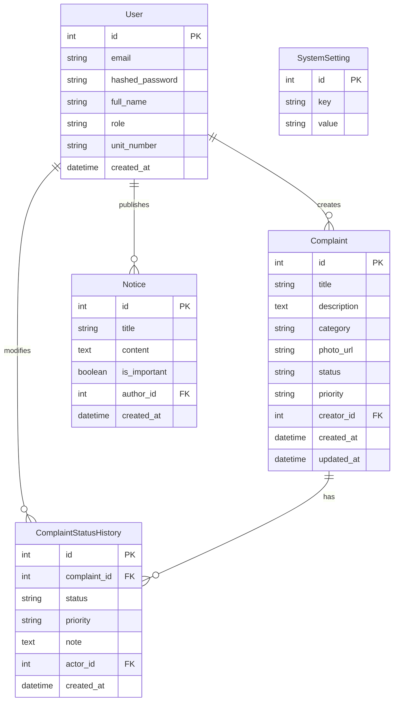
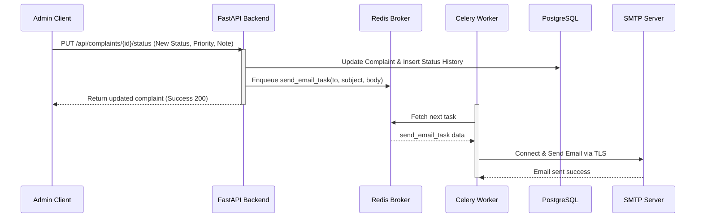

# System Design: Society Maintenance Tracker

This document details the architectural design and implementation strategies for the **Society Maintenance Tracker** platform, highlighting schema design, notification routing, and threshold calculations.

---

## 1. Database Schema & Complaint Lifecycle History Design

The application utilizes a relational database structure (PostgreSQL) to enforce data integrity and enable complex queries, specifically for history tracking and sorting.

### Lifecycle Design
A complaint transitions through three states: `Open` $\rightarrow$ `In_Progress` $\rightarrow$ `Resolved` (Closed).
Rather than simply overwriting states on the `Complaint` table, we implement a **Historical Log Pattern** via the `ComplaintStatusHistory` table. Every update records:
- The state transition (both `status` and `priority`).
- The `actor_id` who authorized the change (to audit if it was an admin or the resident during creation).
- An optional text `note` describing the intervention.

To render the historical timeline, the API fetches the history list ordered by `created_at` ascending, representing a tamper-proof audit trail of the maintenance lifecycle.

---

## 2. Overdue Detection & Priority Handling

### Overdue Calculation
Overdue status is calculated dynamically at query-time rather than stored statically. This ensures accurate flags as time progresses.
The calculation is defined as:
$$\text{is\_overdue} = (\text{Status} \neq \text{"Resolved"}) \land (\text{CurrentTime} - \text{CreatedAt} \ge \text{ThresholdDays})$$

The `ThresholdDays` parameter is retrieved dynamically from the `SystemSetting` table (defaulting to 5 days), enabling admins to adjust the SLA threshold in real-time via the configuration panel without rebuilding or restarting the system.

### Sorting Priority
To assist admins in triaging, complaints are sorted with a composite sorting key:
$$\text{SortKey} = (\text{is\_overdue (descending)}, \text{created\_at (descending)})$$
This guarantees that any complaint breaching the SLA threshold immediately surfaces at the very top of the admin's queue, followed by the newest complaints, regardless of their priority tag.

---

## 3. Photo Upload Handling

For ease of local testing and scalability, the application relies on an **Abstracted Storage Layer** (`StorageService`):
1. **Validation**: Before files are written, they pass through a strict filter verifying:
   - **Allowed Extensions**: `png`, `jpg`, `jpeg`, and `webp` (rejecting executables or scripts to mitigate remote code execution exploits).
   - **Size Restrictions**: Capped at `5MB` (customizable in `.env`) to prevent disk exhaustion.
2. **Persistence**: Files are renamed with a unique UUID hash (`uuid.uuid4().hex`) to avoid naming collisions and stored in `/uploads` mapped via a Docker volume.
3. **AWS S3 Extension**: The service is structured to support swapping local directories with an AWS S3 client simply by wrapping the file stream in `boto3` without changing router controllers.

---

## 4. Notification Flow

To keep residents updated without freezing web request threads, the notification flow leverages a **Broker-Worker Architecture** using **Celery** and **Redis**.

### Flow Breakdown
- **Trigger**: When an admin updates a complaint status, or posts an **Important Notice**.
- **Enqueue**: The backend writes the transaction to PostgreSQL, constructs the email HTML template, and calls `send_email_task.delay()`, pushing the job to Redis.
- **Background Delivery**: The Celery worker picks up the task and establishes a TLS SMTP connection to transmit the email.
- **Fail-safe (Mock Mode)**: During local development, `USE_MOCK_EMAIL=true` prints the email details to the worker standard output and appends the fully rendered HTML message to `/uploads/email_logs.txt`, making verification frictionless without real SMTP accounts.
